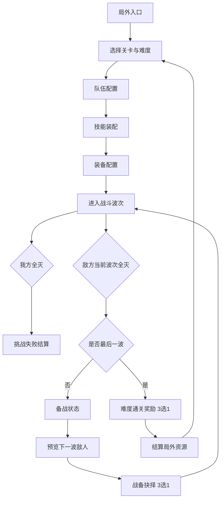

# UI 界面流程草案

本文档只记录界面流程和状态关系，不承载具体美术图。

## 第一版核心流程

## 主要界面

| 界面 | 触发时机 | 必须承载的信息 |
| --- | --- | --- |
| 局外入口 | 进入游戏 | 继续挑战、关卡入口、兵书成长、付费参战位入口 |
| 关卡难度选择 | 开始挑战前 | 关卡解锁状态、10 个难度、解锁条件、推荐压力关键词 |
| 队伍配置 | 挑战前 | 当前参战武将、默认 2 位/付费最多 4 位、羁绊预览 |
| 技能装配 | 挑战前 | 每名武将 6 个技能、当前携带 4 个、关键词和冷却 |
| 装备配置 | 挑战前 | 每名核心武将最多 2 件、装备强化关键词、适配提示 |
| 战斗 HUD | 波次战斗中 | 波次进度、双方状态、关键技能前摇、已选战备能力 |
| 备战状态 | 非最后一波结束后 | 下一波预览入口、战备三选一、已选战备能力摘要 |
| 战备抉择 | 非最后一波结束后 | 3 个候选能力、影响对象、关键词、持续规则 |
| 难度通关奖励 | 当前难度所有波次完成 | 3 个奖励候选、首通奖励、局外资源预告 |
| 兵书成长 | 局外 | 节点等级、消耗资源、弱成长边界 |

## 已确认界面节点

- 主界面 / 地图选关入口已确认，见 [home-map-stage-select-v02.md](home-map-stage-select-v02.md)。
- 阵容编成已确认，见 [lineup-formation-v01.md](lineup-formation-v01.md)。
- 武将技能与装备配置已确认，见 [hero-config-v01.md](hero-config-v01.md)。
- 战斗 HUD 已确认，见 [battle-hud-v07.md](battle-hud-v07.md)。
- 波次战备三选一已确认，见 [battle-prep-choice-v04.md](battle-prep-choice-v04.md)。
- 难度通关奖励已确认，见 [difficulty-clear-reward-v01.md](difficulty-clear-reward-v01.md)。
- 挑战失败结算已确认，见 [challenge-failure-settlement-v03.md](challenge-failure-settlement-v03.md)。
- 兵书成长已确认，见 [meta-upgrade-v02.md](meta-upgrade-v02.md)。

后续新增界面时，先读取 [ui-index.md](ui-index.md)、[ui-guidelines.md](ui-guidelines.md) 和 [asset-manifest.md](asset-manifest.md)，再补充对应节点说明。
