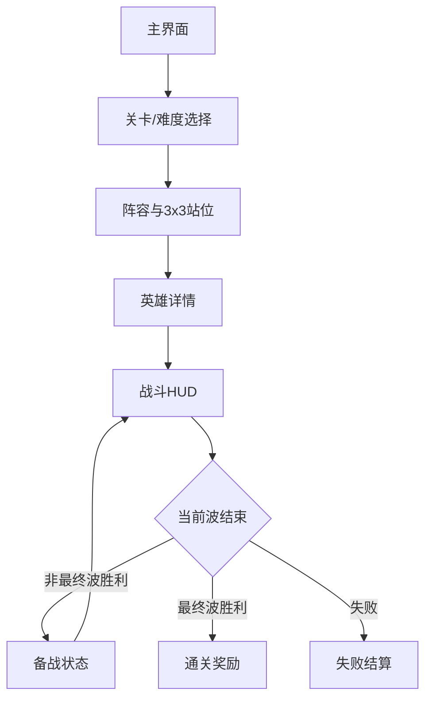

# Screen Flow

当前首轮 Y3 原型流程：

```mermaid
flowchart TD
  A[主界面] --> B[关卡/难度选择]
  B --> C[阵容与3x3站位]
  C --> D[英雄详情]
  D --> E[战斗HUD]
  E --> F{当前波结束}
  F -->|非最终波胜利| G[备战状态]
  G --> E
  F -->|最终波胜利| H[通关奖励]
  F -->|失败| I[失败结算]
```

旧版技能装配、装备配置、战备三选一和羁绊页签不作为当前首轮原型流程。
