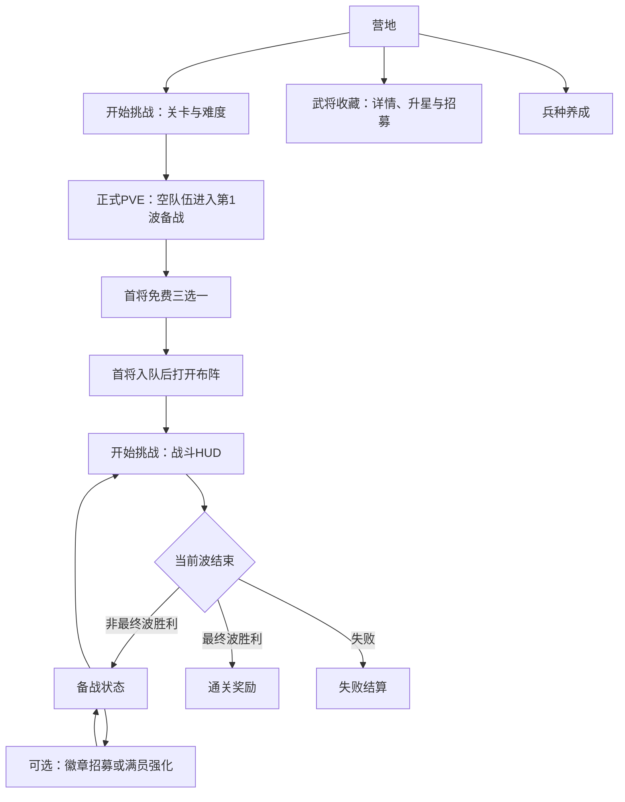

# Screen Flow

当前正式 PVE 流程（2026-11-24）：

```mermaid
flowchart TD
  A[营地] --> B[开始挑战：关卡与难度]
  A --> R[武将收藏：详情、升星与招募]
  A --> T[兵种养成]
  B --> P[正式PVE：空队伍进入第1波备战]
  P --> S[首将免费三选一]
  S --> C[首将入队后打开布阵]
  C --> E[开始挑战：战斗HUD]
  E --> F{当前波结束}
  F -->|非最终波胜利| G[备战状态]
  G --> N[可选：徽章招募或满员强化]
  N --> G
  G --> E
  F -->|最终波胜利| H[通关奖励]
  F -->|失败| I[失败结算]
```

武将收藏不再提供 PVE 局外出战编队。镜像入口本版暂停。历史的「战备三选一」不等于当前局内英雄招募；旧版技能装配和羁绊页签仍不作为当前流程。
